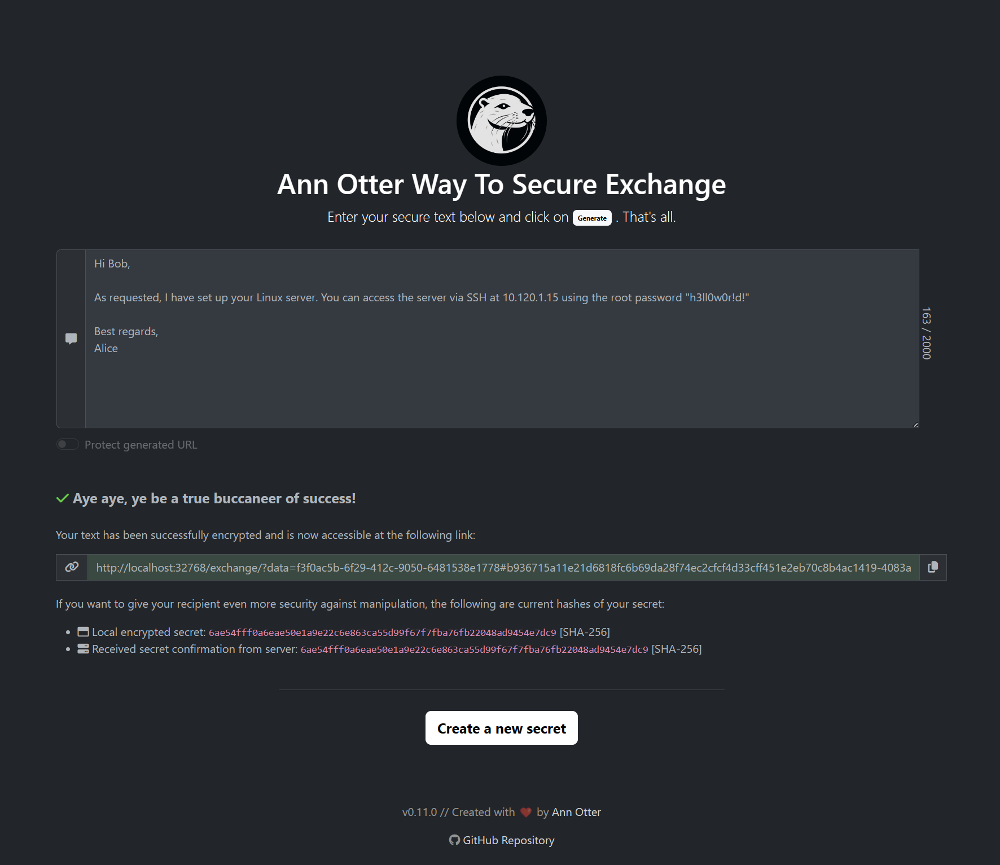

# Ann Otter Way To Secure Exchange

This repository contains a .NET web application designed for secure information exchange. The web application facilitates the exchange of confidential data with several layers of encryption and security measures:

- **Sender-Side Encryption:** Before the sender uploads any confidential text to the server, it is already encrypted, adding an initial layer of security.
- **Optional API Gateway Encryption:** Depending on the image's configuration, the confidential text can be further encrypted at the API Gateway before being stored in the database. This optional step provides an additional layer of security for your data.
- **Secure Sharing:** The sender is provided with a URL that can be shared with the intended recipient. Once accessed, the recipient can view the confidential text just once.
- **Self-Destructing Data:** After the text is decrypted by the recipient, it is automatically removed from the database, ensuring that sensitive information is not stored indefinitely.

# Table of Contents

- [Getting Started](./docs/getting-started.md)
- [How it works](./docs/how-it-works.md)
- [FAQ](./docs/faq.md)
- [CLI Tool](./docs/cli-tool.md)

# Example

## Do you like it more colorful?

The colors and texts of the tool can be fully customized. This means the tool can be used for all purposes, from playful to serious.

        