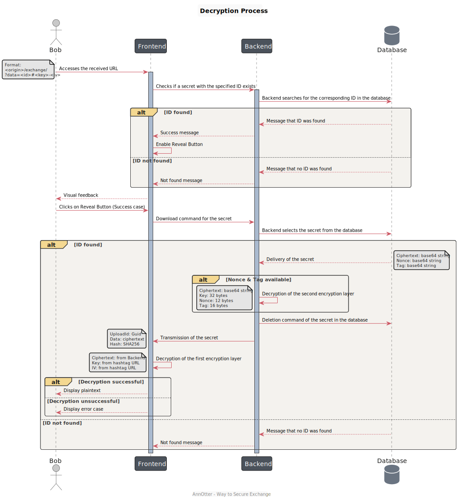

# How it works

This section provides an overview of how the application facilitates the secure sharing of temporary secret information from Alice to Bob.

## Encryption

### Generating and Encrypting the Secret
1. **Alice's Input:** Alice begins the process by entering her secret information into the application's text field.

1. **Generation of a Random Key:** When Alice clicks the "Generate" button, a random CryptoKey is generated using the `generateKey()` Method of [SubtleCrypto](https://developer.mozilla.org/en-US/docs/Web/API/SubtleCrypto/generateKey).

1. **AES-GCM Encryption:** This random CryptoKey is utilized to encrypt Alice's secret text using the AES-GCM algorithm. Notably, all these operations are conducted within the user's web browser, leveraging the [Web Crypto API](https://developer.mozilla.org/en-US/docs/Web/API/Web_Crypto_API).

### Uploading and Storing the Encrypted Data
1. **Uploading to the Application Server:** The encrypted ciphertext is then uploaded to an application server.

1. **Confirmation by the API:** The server's API confirms the successful upload, and Alice can compare the SHA256 hash of the application server's response with her locally stored hash.

1. **Secondary Encryption on the Server:** To prevent potential data leaks caused by database access, the application server further encrypts the received ciphertext using [ChaCha20Poly1305](https://learn.microsoft.com/en-us/dotnet/api/system.security.cryptography.chacha20poly1305?view=net-7.0). The 256 bit key for ChaCha20 and Poly1305 is exclusively stored on the application server.

## Sharing with Bob
1. **Unique URL Generation:** After encryption and successful data storage, the browser generates a unique URL for the secret, which Alice can share with Bob.

## Decryption

### Bob's Access and Decryption
1. **Bob Receives the URL:** Alice shares the URL with Bob, who uses it to access the secret.

1. **URL Contents:** The URL contains the secret's ID (query param) from the database and decryption information that is never transmitted to the server (utilizing hashtag information in the link).

1. **Verification:** Upon accessing the URL, the system checks if a secret with the corresponding ID exists on the server.

1. **Revealing the Secret:** If a match is found, Bob can click the "Reveal" button to retrieve the secret from the server.

1. **Server Decryption:** The application server retrieves data from the database, decrypts the ChaCha20 ciphertext, and transmits the already AES-GCM-encrypted information to Bob's browser.

1. **Server-Side Key Deletion:** After successful decryption on the server, the key is irrevocably deleted from the database server.

1. **Local Decryption:** Bob's browser uses the keys obtained from the URL's hashtag to locally decrypt the received ciphertext, allowing him to read Alice's message in plain text.

In the event that the local keys are incorrect or if someone has intercepted the message (e.g., Eve), an appropriate error message will appear, enabling Bob to notify Alice of potential issues with the transmission or the possibility of interception.

## Housekeeping

The application allows you to configure the "retention time" for secrets. This feature enables the automatic deletion of secrets that have exceeded the specified retention time on the server.

## Protect generated URL

In this section of the project, we focus on securing the generated URL using AES-GCM encryption with a generated key. The primary objective of this function is to ensure that the URL can be safely transmitted over an unsecured line. The encrypted URL will be inaccessible without an additional key, which is necessary to reveal the actual Secret Exchange URL. This approach enhances the security of the URL, making it resilient against intercepts and unauthorized access during transmission.

